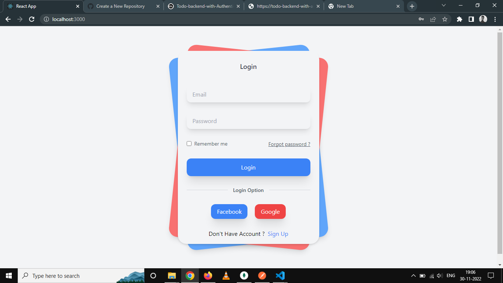
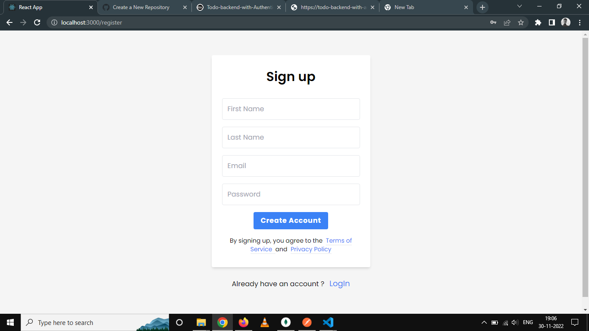
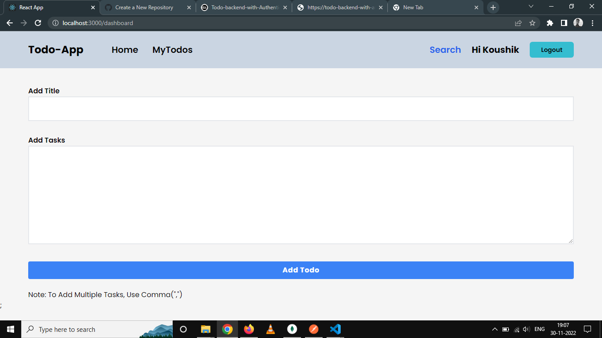
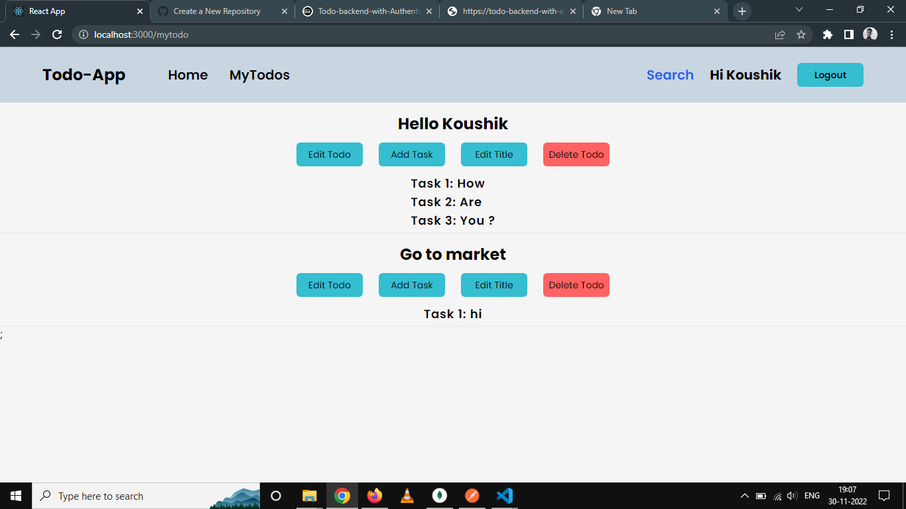

# This is MERN Todo App with React.

I gave lots of effort to complete this Project. Using Tailwind, React,HTML5, and NodeJS The new Utilities.

# View this Project On Netlify, Here is the Link.

**Link :** **[TODO MERN APP](https://mytodos.up.railway.app/)**

## Demo email and password -

Email - **hellouser@gmail.com**

Password - **Hello#111**

# Here is the Screenshots, take a look.

**Thank You.**
